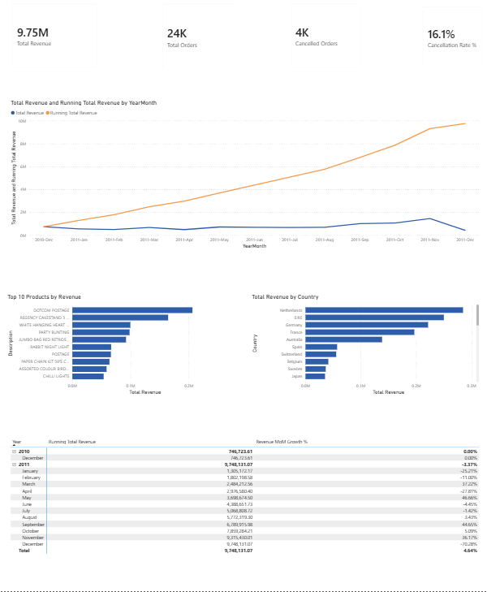
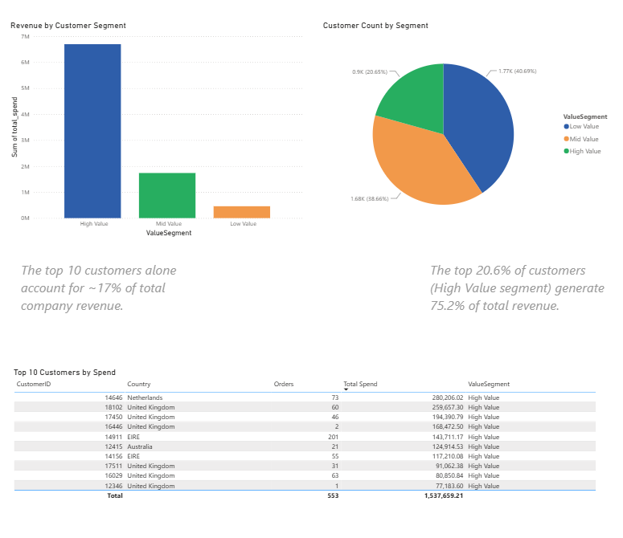
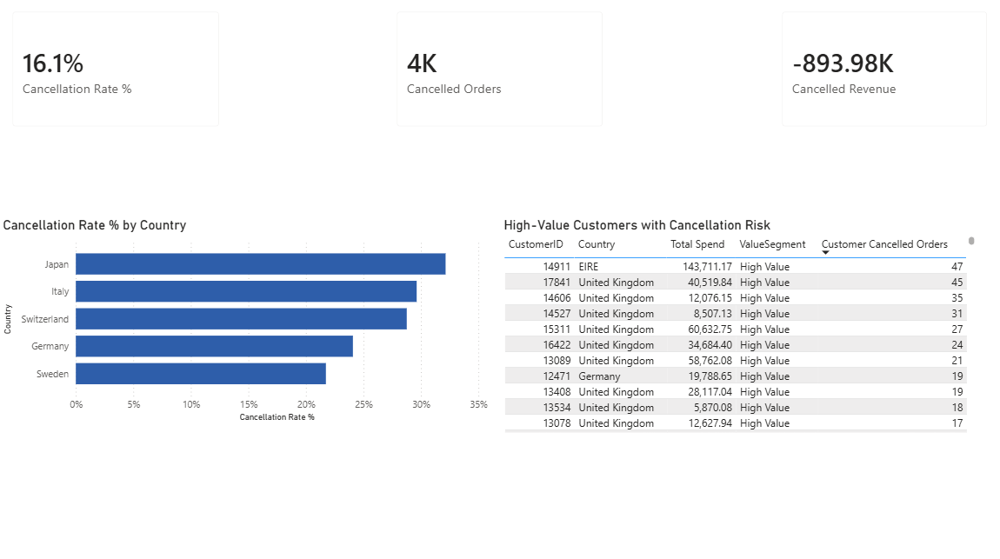

# UK Online Retail — Sales Performance & Customer Risk

A Python + Excel + Power BI portfolio project analysing 12 months of transaction data from a real UK-based online retailer, covering revenue performance, customer segmentation, and cancellation/revenue risk.

This is my second portfolio project, following [nhs-eye-clinic-followup-dashboard](#) (SQL/Power BI, NHS ophthalmology backlog analysis). Where that project used a SQL-first pipeline, this one deliberately builds a **Python-first** workflow — showing the same analytical approach (surfacing risk and prioritisation from messy operational data) applied outside a healthcare context, and with a different toolchain.

## Dashboard preview

**Revenue & Performance**


**Customer Segmentation**


**Cancellation & Risk**


## Data source

**Online Retail** — UCI Machine Learning Repository
Chen, D. (2015). *Online Retail* [Dataset]. https://doi.org/10.24432/C5BW33

541,909 transaction line items from a UK-based, non-store online retailer selling all-occasion gifts, December 2010 – December 2011. Real commercial data (anonymised), CC BY 4.0 licence.

## Method

1. **Python (pandas)** — loaded, explored, and cleaned the raw transaction file; engineered a `LineTotal` field and cancellation flag; resolved a duplicate-customer data quality issue; built a customer-level summary table with value segmentation.
2. **Excel** — used as a validation checkpoint between the Python cleaning step and the Power BI build: PivotTables to sanity-check monthly revenue and segment splits before trusting the numbers in a dashboard.
3. **Power BI** — final reporting layer. Built a data model (fact table + customer dimension + date dimension), wrote DAX measures, and produced a three-page report.

## Architecture

```
Raw Excel file (541,909 rows)
      │
      ▼
Python (pandas) — 01_clean_and_transform.py
      │
      ├── sales_clean.csv          (534,129 rows — cleaned transaction-level data)
      └── customer_summary.csv     (4,346 customers — segmented, one row per customer)
                │
                ▼
      Excel — retail_clean_data.xlsx (validation PivotTables)
                │
                ▼
      Power BI data model
      ├── sales_clean       (fact table)
      ├── customer_summary  (customer dimension)
      └── Date              (calendar dimension, DAX CALENDAR())
                │
                ▼
      Three-page report (see below)
```

## Data quality decisions

A few real issues were found and deliberately handled, rather than ignored:

- **Missing `CustomerID` (135,080 rows, ~25%)** — kept in the fact table for revenue totals, excluded from all customer-level analysis (you can't segment a customer you can't identify).
- **~1,336 rows with negative quantity but no cancellation flag** — the cancellation flag (`InvoiceNo` starting with "C") doesn't fully align with negative quantities, suggesting some negative-quantity rows are stock corrections rather than customer cancellations. Both are retained; the mismatch is noted rather than resolved, since neither category should be discarded.
- **Duplicate customer/country records** — building the customer summary by grouping on `CustomerID` and `Country` together produced duplicate rows for customers logged under more than one country across their order history. Fixed by resolving each customer's most frequent country separately (a pandas equivalent of `ROW_NUMBER()`), then grouping by `CustomerID` alone.
- **Non-product line items** (`DOTCOM POSTAGE`, `POSTAGE`) — excluded from the Top 10 Products chart, since including shipping charges in a "best-selling products" ranking would be misleading.
- **Rows with missing `Country` and `CustomerID`** (~1,450 rows) — likely orders with an incomplete checkout or export gap. These are included in overall revenue totals but excluded from the country-level breakdown, since they can't be meaningfully attributed anywhere.
- **Floating-point rounding artefacts** — `Quantity × UnitPrice` produced values like `15.299999999999999` due to standard binary floating-point imprecision. Fixed at the source in Python (`.round(2)`), not just at the display/formatting layer, so every downstream export inherits clean values.

## Key findings

- **Revenue concentration (Pareto pattern):** the top 20.6% of customers (the "High Value" segment, 894 people) generate 75.2% of total revenue (£6.69M of £8.89M), while the bottom 40.8% ("Low Value", 1,772 people) contribute just 5.2%. Strong case for prioritising retention and account management on the high-value segment.
- **The top 10 customers by spend alone account for approximately 17% of total company revenue** — a small number of accounts carrying an outsized share of the business.
- **Seasonal growth pattern:** revenue climbs steadily through 2011, with strong month-over-month growth in March (+37%), May (+47%), September (+45%), and November (+36%) — building toward the pre-Christmas gift-buying peak, consistent with this being an "all-occasion gifts" retailer. December 2011's apparent −70% MoM drop is **not a real decline** — it's a dataset artefact, since the source data only covers the first 9 days of December 2011.
- **Japan shows the highest cancellation rate at ~30%+**, nearly double the platform average of 16.1% — worth investigating for potential causes (shipping issues, product fit, or customer expectations mismatch for that market). Cancellation rate analysis by country is limited to markets with meaningful order volume (>10 orders); most international markets have too few orders for cancellation rate to be statistically meaningful.
- A small number of high-value customers show concerning cancellation patterns (e.g. one High Value customer with 47 cancelled orders) — flagged in the Cancellation & Risk page as candidates for account review.

## Report pages

1. **Revenue & Performance** — KPI cards, monthly revenue trend with running total, month-over-month growth, top 10 products by revenue, revenue by country.
2. **Customer Segmentation** — revenue and customer count by value segment (High/Mid/Low), top 10 customers by spend.
3. **Cancellation & Risk** — cancellation rate by country, cancelled revenue, high-value customers with concerning cancellation patterns.

## Technical notes (things worth knowing if you're reviewing the build)

**Gotcha 1 — duplicate customer records from grouping by Country.**
Building `customer_summary` by grouping on `[CustomerID, Country]` together created duplicate rows for any customer who'd been logged under more than one country across their order history — this broke the "one row per customer" assumption Power BI needs for a clean relationship. Fixed by resolving each customer's most frequent country separately (a pandas equivalent of the `ROW_NUMBER()` technique), then grouping by `CustomerID` alone.

**Gotcha 2 — datetime vs. date-only relationship mismatch.**
The `Date` table stored plain dates (midnight), but `sales_clean[InvoiceDate]` stored full timestamps (date + time of each transaction) — so almost no rows matched between the two tables, and Power BI silently dumped everything into one blank, unlabelled row. Fixed by creating a new `InvoiceDateOnly` column (stripping the time component) and relating `Date` to that instead of the raw `InvoiceDate`.

**DAX measures written:** `Total Revenue`, `Total Orders` (`DISTINCTCOUNT`, not `COUNT`, since each order has multiple line items), `Cancelled Orders`, `Cancellation Rate %` (`DIVIDE` with a safe zero-fallback), `Running Total Revenue` (`CALCULATE` + `ALLSELECTED` + `FILTER`), `Revenue MoM Growth %` (`DATEADD` for prior-period comparison), `Cancelled Revenue`, `Customer Cancelled Orders`.

## Tools

Python (pandas, openpyxl) · Excel (PivotTables) · Power BI (data modelling, DAX, report design)

## How to reproduce

1. Download the dataset from the UCI repository link above.
2. Set up a Python virtual environment and install dependencies: `pip install pandas openpyxl`.
3. Run `01_clean_and_transform.py` against the raw file to produce `sales_clean.csv` and `customer_summary.csv`.
4. Open Power BI Desktop, load both CSVs, and build the date table and relationships as described above.
5. Alternatively, open the included `.pbix` file directly.
